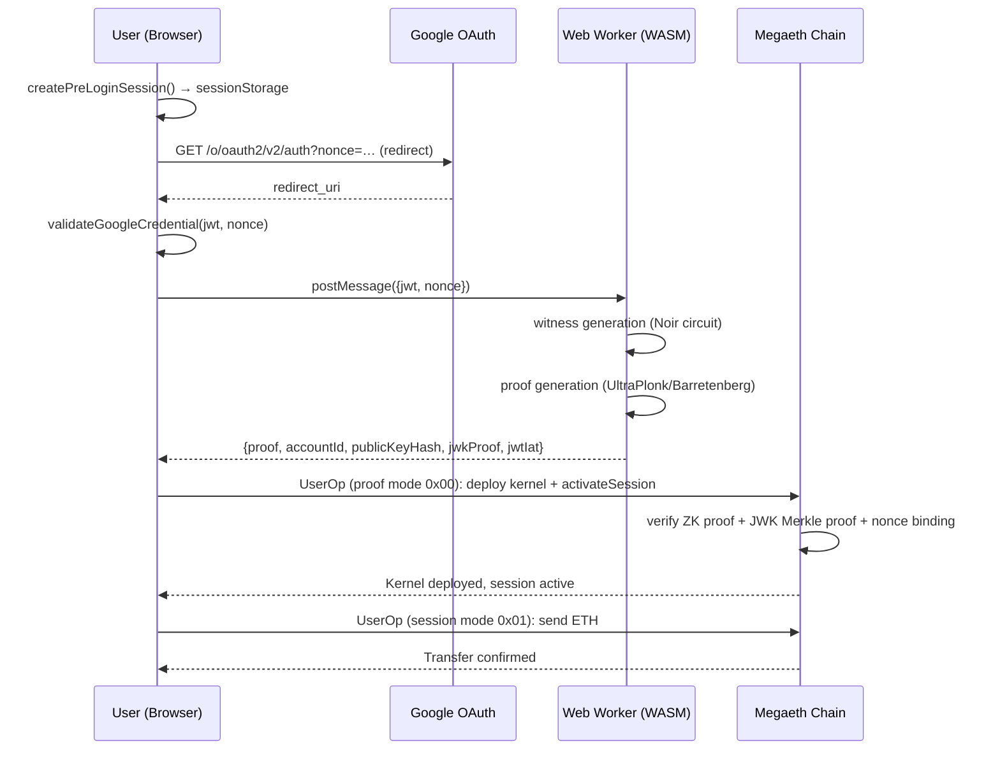

# zkLogin Native Wallet — Architecture

A browser-based zero-knowledge proof wallet POC. Google identity → local ZK proof → on-chain smart account activation on Megaeth testnet (chain 6343). No custody, no hosted prover.

## System overview



## Repository layout

```
.
├── apps/web/                      # Main app (Vite + React 19 + TypeScript)
│   ├── src/
│   │   ├── App.tsx                # Root: stage machine, OAuth callback, session restore
│   │   ├── config.ts              # Frozen config from VITE_* env vars + deployment JSON
│   │   ├── main.tsx               # createRoot, no wrappers
│   │   ├── style.css              # All styles (~700 lines)
│   │   ├── auth/                  # Auth + ZK proof pipeline
│   │   │   ├── googleOAuth.ts     # buildOAuthUrl, parseIdTokenFromFragment, clearFragment
│   │   │   ├── nonce.ts           # createPreLoginSession, computeSessionNonce, PreLoginSession
│   │   │   ├── validateJwt.ts     # validateGoogleCredential (iss/aud/nonce/iat/exp)
│   │   │   ├── prove.ts           # proveInBrowser — spawns worker, 5-min timeout
│   │   │   └── prover.worker.ts   # WASM proof gen (witness + proof phases)
│   │   ├── aa/                    # Account abstraction (ZeroDev Kernel v3.3)
│   │   │   ├── client.ts          # createWalletClients, publicClient, waitForSuccess
│   │   │   └── zkLoginValidator.ts # toZkLoginKernelValidator, makeActivationCallData
│   │   ├── lib/                   # Utils, session, types, reducer
│   │   │   ├── session.ts         # loadOrCreatePreLogin, assertActivated
│   │   │   ├── types.ts           # Stage, Wallet, StoredReadySession, SendAction
│   │   │   ├── utils.ts           # shortAddress, requireBytes32, storage keys
│   │   │   └── reducer.ts         # sendReducer (boolean state machine)
│   │   ├── components/            # React UI
│   │   │   ├── Onboarding.tsx     # Sign-in UI, progress bar, error display
│   │   │   ├── WalletView.tsx     # Balance, send form, session info
│   │   │   └── Icons.tsx          # SVG icons (Copy, Arrow, Refresh)
│   │   ├── benchmark/             # Benchmark worker + fixture
│   │   ├── generated/             # Build artifacts
│   │   │   ├── deployment-megaeth.json  # Contract addresses, JWK root, app ID
│   │   │   ├── jwk-snapshot.json        # Frozen Google JWKS snapshot with Merkle proofs
│   │   │   └── benchmark-fixture.json   # Test JWT + JWK data
│   │   └── test/
│   │       └── validatorEncoding.test.ts # Wire format tests
│   ├── public/
│   │   └── _headers               # Cloudflare Pages COOP/COEP + security headers
│   ├── index.html                 # Minimal HTML shell
│   ├── benchmark.html             # Standalone benchmark runner
│   ├── vite.config.ts             # Vite 8 config, COI headers for BENCH_COI=1
│   ├── .env.example               # Template for required env vars
│   └── .env.local                 # Local secrets (gitignored)
├── contracts/                     # Foundry project (Solidity)
│   ├── src/
│   │   ├── ZkLoginKernelValidator.sol  # Kernel v3.3 secondary validator
│   │   └── UltraVerifier.sol           # Noir Groth16 verifier (auto-generated)
│   ├── test/
│   │   ├── ZkLoginKernelValidator.t.sol # Foundry tests
│   │   └── ProtocolTestHelpers.sol
│   ├── script/Deploy.s.sol        # Forge deploy script
│   ├── foundry.toml               # Solidity 0.8.27, optimizer 200 runs
│   └── lib/                       # Git submodules (forge-std, openzeppelin)
├── scripts/                       # Node.js tooling
│   ├── test-contracts.mjs         # Node-based integration suite (solc + ganache)
│   ├── test-coi-webkit.mjs        # Playwright COI verification (WebKit + Chromium)
│   ├── serve-coi.mjs              # Local COI server at :8787
│   ├── run-benchmark.mjs          # Puppeteer-based proof benchmarks
│   ├── gen-benchmark-fixture.mjs  # Fixture generation
│   ├── verify-deployment.mjs      # Post-deploy verification
│   ├── snapshot-google-jwks.mjs   # Fetch + freeze Google JWKS → jwk-snapshot.json
│   ├── make-app-id.mjs            # Derive OAuth app ID
│   └── check-prereqs.mjs          # Env var validation
├── bench-results/                 # Historical benchmark data
├── .github/workflows/ci.yml       # CI/CD pipeline
├── proof-enhancement-plans.md     # Deep-dive on proof acceleration strategy
├── TODOS.md                       # Known gaps (contract, UI, auth)
├── SETUP.md                       # Setup guide
└── README.md                      # Project overview
```

## Stage machine

The app is a finite state machine. `Stage` type defined in `apps/web/src/lib/types.ts`:

| Stage | Meaning | Entry condition |
|---|---|---|
| `PREPARING` | Initial mount, session being restored | App mount |
| `GOOGLE_READY` | PreLogin session exists, waiting for OAuth callback | Restore found no saved session, or user reset |
| `PROVING` | Worker is generating ZK proof | User returned from Google with id_token |
| `ACTIVATING` | UserOp submitted, waiting for on-chain confirmation | Proof generation succeeded |
| `READY` | Wallet active, can send ETH | Activation confirmed on-chain |
| `ERROR` | Fatal error, can reset | Any step failed irrecoverably |

State transitions are implicit (React `useState`), not a formal reducer. The `sendReducer` is a separate boolean sub-machine for the send button state.

## Auth flow — detailed

### 1. PreLogin session (`nonce.ts`)

`createPreLoginSession()` generates:
- Ephemeral ECDSA **private key** (`generatePrivateKey()` from viem)
- `sessionKey` = derived address
- `sessionValidUntil` = `now + 24h`
- `randomness` = 32 random bytes from `crypto.getRandomValues`
- `nonce` = `keccak256(SESSION_DOMAIN ‖ chainId ‖ validator ‖ appId ‖ sessionKey ‖ validUntil ‖ randomness)` — binds the full session context
- `googleNonce` = `nonce.slice(2).toLowerCase()` — hex string without `0x` prefix, passed to Google OAuth

Stored in `sessionStorage` under `zklogin.prelogin.v1`. TTL: 300 seconds (`loadOrCreatePreLogin` regenerates if expired).

The nonce binds the ephemeral session to the Google auth, preventing replay and session-hijacking. The same nonce is cryptographically derived on-chain by `ZkLoginKernelValidator.sessionNonce()`.

### 2. OAuth redirect (`googleOAuth.ts`)

Pure OAuth 2.0 Implicit Flow — no `@react-oauth/google`, no cross-origin script loads.

```
buildOAuthUrl({clientId, redirectUri, nonce})
→ https://accounts.google.com/o/oauth2/v2/auth
    ?response_type=id_token
    &client_id=…
    &redirect_uri=…
    &nonce=…
    &scope=openid email profile
```

User clicks → `window.location.assign(url)` → full page redirect to Google → Google authenticates → redirects back to `redirect_uri#id_token=JWT&…`.

The `id_token` is extracted from the URL fragment via `parseIdTokenFromFragment()` (parses `window.location.hash` with `URLSearchParams`). After extraction, `clearFragment()` uses `history.replaceState` to clean the URL without a reload.

### 3. JWT validation (`validateJwt.ts`)

Client-side only using `jose` library (`decodeJwt`, `decodeProtectedHeader`). Validates:
- `alg` = `RS256`, `kid` present
- `iss` = `https://accounts.google.com` or `accounts.google.com`
- `aud` = `config.googleClientId`
- `nonce` = `expectedNonce` (the `googleNonce` from the PreLogin session)
- `iat` within ±300s of now (clock skew tolerance)
- `exp` > now

Returns the decoded JWT payload for `sub`, `iat`, etc.

### 4. Proof generation (`prove.ts` + `prover.worker.ts`)

`proveInBrowser(jwt, expectedNonce, onProgress?)`:
- Spawns a **new** module Worker for every proof
- Posts `{jwt, expectedNonce}` to the worker
- 5-minute timeout (kills worker + rejects)
- Worker reports phases: `witness` → `proof`

Worker (`prover.worker.ts`):
1. Creates `FrozenPublicKeyRegistry` — extends `zklogin.PublicKeyRegistry`, serves JWKs from the baked-in `jwk-snapshot.json` (no network fetch)
2. Calls `new zklogin.ZkLogin(registry).proveJwt(jwt, expectedNonce)` which internally:
   - Validates JWT structure
   - Generates witness via Noir circuit execution
   - Generates UltraPlonk proof via `@aztec/bb.js` (Barretenberg WASM)
3. Looks up the matching JWK in the snapshot to retrieve pre-computed Merkle proof (`jwkProof`)
4. Returns `BrowserProof`: `{proof, accountId, jwtIat, publicKeyHash, jwkProof}`

Key constraint: `SharedArrayBuffer` is **required** for multithreaded WASM. Without COOP+COEP headers, Barretenberg silently falls back to single-threaded: ~7-15s multithreaded vs ~47-67s single-threaded.

The JWK snapshot (`jwk-snapshot.json`) is frozen at build time. It contains:
- Google's JWKS keys with their limb decomposition (for the Noir circuit)
- A Merkle tree over all key hashes (root = `googleJwkRoot`)
- Pre-computed Merkle proofs (`jwkProof[]`) for each key

This avoids network calls to `https://www.googleapis.com/oauth2/v3/certs` during proof generation. The snapshot must be updated when Google rotates keys. Run `pnpm snapshot:jwks` to refresh.

### 5. Wallet activation (`App.tsx` → `aa/`)

After receiving `BrowserProof`, `completeGoogleLogin()`:

1. Validates JWT claims (iat match)
2. Re-derives session signer from stored private key
3. Constructs `ProofAuth`: `{proof, jwtIat, publicKeyHash, jwkProof, sessionKey, sessionValidUntil, randomness}`
4. Builds activation `callData` via `makeActivationCallData()`:
   ```
   Kernel.execute(
     execMode=0x00…00,
     executionCalldata=validatorAddress ‖ uint256(0) ‖ activateSession(sessionKey, validUntil, randomness)
   )
   ```
5. Creates `toZkLoginKernelValidator()` — wraps the session signer as a ZeroDev `KernelValidator` with custom `signUserOperation`/`getStubSignature`/`getEnableData`

**Signature modes** (`zkLoginValidator.ts`):
- **Proof mode** (`0x00`): For the activation UserOp. Encodes: `0x00 ‖ abi.encode(ProofAuth + sessionSignature)`. Contains the ZK proof, JWK Merkle proof, session params, and ECDSA signature from the session key over the UserOp hash.
- **Session mode** (`0x01`): For subsequent UserOps. Encodes: `0x01 ‖ ecdsa_signature`. Simple ECDSA from the registered session key.

6. Submits the activation UserOp via ZeroDev bundler (paymaster-sponsored)
7. Waits for on-chain success
8. Calls `assertActivated()` — reads `accountState` from the validator contract to confirm the kernel is deployed and the session key is registered
9. Persists `StoredReadySession` to `sessionStorage` under `zklogin.ready.v1`

### 6. Session restore (`App.tsx` useEffect)

On mount, if `zklogin.ready.v1` exists in `sessionStorage`:
1. Parses the stored session (version check, expiry check)
2. Re-derives signer from `privateKey`
3. Rebuilds `KernelValidator` (without `proofAuth` — session mode only)
4. Recreates wallet clients via `createWalletClients()`
5. Verifies kernel address matches on-chain deployment
6. Calls `assertActivated()` to confirm the session is still valid on-chain

This allows page reloads without re-proving. The session key remains valid until `sessionValidUntil` (24h from creation).

## On-chain contracts

### ZkLoginKernelValidator.sol

ZeroDev Kernel v3.3 **secondary validator** (validator type ID = 1). Implements `IValidator`.

**Storage**:
- `accountState: mapping(address kernel => AccountState)` — per-kernel account state
- `AccountState`: `{accountId, sessionKey, sessionValidUntil}`
- Immutables: `proofVerifier`, `googleJwkRoot`, `appId`

**Constants**:
- `SESSION_DOMAIN` = `keccak256("ZKLOGIN_KERNEL_SESSION_V1")` — must match `nonce.ts`
- `PROOF_WINDOW` = 10 minutes — how long a proof-mode UserOp is valid
- `CLOCK_SKEW` = 5 minutes — tolerance for iat validation
- `MAX_SESSION` = 24 hours — maximum session duration

**Lifecycle**:
1. `onInstall(data)` — kernel deployment. Stores `accountId` from `enableData`.
2. `activateSession(sessionKey, validUntil, randomness)` — called via proof-mode UserOp. Registers the session key.
3. `validateUserOp(userOp, userOpHash)` — two modes:
   - Mode `0x00` (Proof): `_validateProofMode()` — verifies ZK proof, JWK Merkle proof, session nonce, exact activation callData, session signature. Returns `_packValidationData(iat-CLOCK_SKEW, iat+PROOF_WINDOW)`.
   - Mode `0x01` (Session): `_validateSessionMode()` — verifies ECDSA signature from registered session key. Returns `_packValidationData(0, sessionValidUntil)`.
4. `onUninstall()` — deletes account state.

**`_validateProofMode` checks** (any failure returns `SIG_VALIDATION_FAILED`):
1. `sessionKey != address(0)`
2. `jwtIat` within bounds
3. `sessionValidUntil` within `iat + MAX_SESSION + CLOCK_SKEW`
4. `_isExactActivation(callData, auth)` — exact `keccak256` match on `Kernel.execute(0, validator ‖ 0 ‖ activateSession(…))`
5. JWK Merkle proof: `MerkleProof.verify(jwkProof, googleJwkRoot, keccak256(publicKeyHash))`
6. ZK proof: `proofVerifier.verify(proof, [accountId, jwtIat, publicKeyHash, …nonceChars…])`
7. ECDSA recovery: `sessionKey == recover(userOpHash, sessionSignature)`

**Public inputs to the ZK verifier** (67 × bytes32):
- `inputs[0]` = `accountId`
- `inputs[1]` = `jwtIat` (as bytes32)
- `inputs[2]` = `publicKeyHash`
- `inputs[3..66]` = ASCII characters of the session nonce hex string (64 hex chars → 64 bytes32, one per char)

This encoding mirrors the Noir circuit's public input layout.

### UltraVerifier.sol

Auto-generated Noir Groth16 verifier from `@shield-labs/zklogin-contracts@0.5.0`. Fixed circuit: 226,727 gates rounded to a 262,144-element subgroup. Proof size: 2,144 bytes. Implements `IProofVerifier.verify(proof, publicInputs) → bool`.

## Account abstraction (`aa/`)

### client.ts
- `entryPoint` = EntryPoint v0.7 (`getEntryPoint('0.7')`)
- `kernelVersion` = `KERNEL_V3_3`
- `publicClient` = viem public client for Megaeth testnet
- `createWalletClients(validator)`:
  1. `createKernelAccount` with `index: 0n`, `plugins: {sudo: validator}`
  2. Creates ZeroDev paymaster client for gas sponsorship
  3. Creates `KernelAccountClient` with bundler transport + paymaster
  4. Returns `{account, kernelClient}`
- `waitForSuccess(kernelClient, hash)`: waits up to 60s, 300 retries, throws on revert

### zkLoginValidator.ts
- `makeActivationInnerData(args)` → `activateSession(sessionKey, validUntil, randomness)` ABI-encoded
- `makeActivationCallData(args)` → `Kernel.execute(zeroHash, validator ‖ 0 ‖ innerData)` ABI-encoded
- `toZkLoginKernelValidator(args)` → `KernelValidator<'ZkLoginKernelValidator'>`:
  - Wraps session signer as a `LocalAccount` (rejects `signTransaction`, supports `signMessage`/`signTypedData`)
  - `getEnableData()` → `abi.encode(accountId)` — passed to `onInstall` during kernel deployment
  - `getStubSignature(op)` — returns dummy signature for gas estimation. Mode 0x00 if activation, mode 0x01 otherwise.
  - `signUserOperation(op)` — signs the UserOp hash with session key. Mode 0x00 includes proof auth, mode 0x01 is just the signature.
  - `isEnabled()` → `false` (forces enable during activation, the `sudo` validator plugin auto-enables on first use)

## Session storage keys

| Key | Storage | Content | Lifetime |
|---|---|---|---|
| `zklogin.prelogin.v1` | sessionStorage | `PreLoginSession` JSON | 300s TTL, regenerated on expiry |
| `zklogin.ready.v1` | sessionStorage | `StoredReadySession` JSON | Until `sessionValidUntil` (24h) |
| `zklogin.mobile-disclaimer` | sessionStorage | `"1"` | Until tab close |

## Config

`apps/web/src/config.ts` freezes a `config` object from:
- `import.meta.env.VITE_*` (Vite 8 requires dot notation — `VITE_FOO`, not `import.meta.env[name]`)
- `./generated/deployment-megaeth.json` (contract addresses, JWK root, app ID)

Validates at import time:
- `deployment.generation >= 1 && deployment.chainId === 6343`
- `validatorAddress`, `ultraVerifierAddress` are non-zero
- `googleJwkRoot`, `appId` are non-zero bytes32
- All `VITE_*` vars are non-empty

## CI/CD (`ci.yml`)

| Trigger | Jobs |
|---|---|
| Push to `main` | `web` (typecheck → test → build → contract test) → `contracts` (forge fmt/build/test) → `deploy` |
| PR | `web` + `contracts` → `deploy-preview` → PR comment with URL |
| PR closed/merged | `cleanup-preview` (Cloudflare API delete) |

**Deploy (`deploy` job)**:
- Validates secrets format (client ID contains `.apps.googleusercontent.com`, project ID is UUID)
- Builds with `VITE_REDIRECT_URL=https://zklogin-poc.rahrt.com`
- `wrangler pages deploy apps/web/dist --project-name=zklogin-poc`

**Preview deploy (`deploy-preview` job)**:
- Builds with `VITE_REDIRECT_URL=window.location.origin` (uses current origin at runtime)
- Deploys with `--branch=<sanitized-branch-name>`
- Updates (not reposts) the PR comment with stable alias URL

**Cleanup**: Finds Cloudflare deployment by branch name prefix (truncated to 28 chars) and deletes via API.

## Headers

`apps/web/public/_headers` (Cloudflare Pages static header rules):

```
/*
  Cross-Origin-Opener-Policy: same-origin
  Cross-Origin-Embedder-Policy: require-corp
  Permissions-Policy: cross-origin-isolated=(self)
  Cache-Control: public, max-age=0, must-revalidate
  X-Content-Type-Options: nosniff
  Referrer-Policy: strict-origin-when-cross-origin
```

COOP+COEP enable `SharedArrayBuffer` → multithreaded WASM proving. No CSP (deliberately permissive for POC). Cache is disabled to ensure fresh deployments.

## Proving performance

| Scenario | Time | Memory (WASM) |
|---|---|---|
| Multithreaded (COI, 8 threads, cold) | ~10.7s | ~2.86 GB |
| Multithreaded (COI, 8 threads, warm) | ~7s | ~2.86 GB |
| Single-threaded (no COI) | ~47-67s | ~2.94 GB |
| Zero-witness key construction (8 threads) | ~2.3s | +1.17 GB |

See `proof-enhancement-plans.md` for the full acceleration strategy: COI headers, persistent worker, removing eager zero-witness key, polynomial cache tuning, WebGPU MSM/NTT.

## Key invariants

1. **Proof stays client-side.** JWT, nonce, witness, session private key never leave the browser.
2. **Circuit + on-chain format frozen.** `@shield-labs/zklogin-contracts@0.5.0`, UltraPlonk, 67 public inputs, 2,144-byte proofs.
3. **No network calls during proof.** JWK snapshot frozen at build time. Google OAuth is a pure redirect — no cross-origin scripts.
4. **Nonce binds everything.** `nonce = keccak256(SESSION_DOMAIN ‖ chainId ‖ validator ‖ appId ‖ sessionKey ‖ validUntil ‖ randomness)`. Same derivation on-chain (`sessionNonce()`) and in-browser (`computeSessionNonce()`). Passed as Google OAuth nonce. Prevents replay and cross-session attacks.
5. **Activation is exact.** `_isExactActivation` enforces `keccak256` match on callData. Proof-mode UserOps can only encode `activateSession` with the exact params from the proof. Session-mode UserOps can do arbitrary calls.
6. **Session key is ephemeral.** Generated per-session, valid 24h max. Private key stored in `sessionStorage` only. Lost on tab close.
